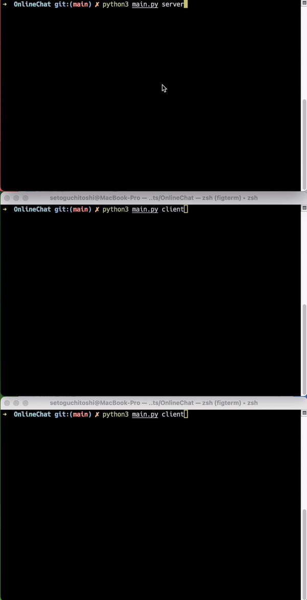

# Online-Chat-Messenger

## 概要
このプロジェクトは簡易ネットワークチャットアプリケーションです。

ユーザーはクライアントを通じてサーバーに接続し、チャットルームを作成または参加し、メッセージの送受信ができます。

## 主な特徴
- **チャットルームの管理**: TCPを使用して、サーバーとクライアント間でチャットルームの作成と参加を管理。
- **リアルタイムメッセージング**: UDPを使用したリアルタイムでのメッセージの送受信。
- **ユーザー認証**: ユーザー名とパスワードによる認証システム。

## 技術スタック
- 言語: Python (ver 3.10.9)
- ネットワーキング: TCP/IP, UDP

## セットアップ
このセクションでは、プロジェクトをローカルで実行するための手順を説明します。

1. サーバーを起動する：
   ```
   python3 main.py server
   ```
2. 別のターミナルでクライアントを起動する：
   ```
   python3 main.py client
   ```

## 使用方法
1. サーバーを起動した後、クライアントを実行してサーバーに接続します。
2. ユーザー名とパスワードを入力して認証を行い、チャットルームを作成または参加し、メッセージの送受信を行います。

## 使用例

